<!--
  Licensed to the Apache Software Foundation (ASF) under one or more
  contributor license agreements.  See the NOTICE file distributed with
  this work for additional information regarding copyright ownership.
  The ASF licenses this file to You under the Apache License, Version 2.0
  (the "License"); you may not use this file except in compliance with
  the License.  You may obtain a copy of the License at
      http://www.apache.org/licenses/LICENSE-2.0
  Unless required by applicable law or agreed to in writing, software
  distributed under the License is distributed on an "AS IS" BASIS,
  WITHOUT WARRANTIES OR CONDITIONS OF ANY KIND, either express or implied.
  See the License for the specific language governing permissions and
  limitations under the License.
-->

# Apache NiFi MiNiFi C++ - Technical Architecture Documentation

## Table of Contents

- [Overview](#overview)
- [System Architecture](#system-architecture)
  - [High-Level Architecture](#high-level-architecture)
  - [Core Components](#core-components)
  - [Component Relationships](#component-relationships)
- [Data Flow Architecture](#data-flow-architecture)
  - [FlowFile Lifecycle](#flowfile-lifecycle)
  - [Processing Pipeline](#processing-pipeline)
  - [Data Routing](#data-routing)
- [Extension System](#extension-system)
  - [Extension Framework](#extension-framework)
  - [Available Extensions](#available-extensions)
  - [Extension Loading](#extension-loading)
- [Configuration Architecture](#configuration-architecture)
  - [Configuration Flow](#configuration-flow)
  - [Parameter Management](#parameter-management)
  - [Runtime Configuration](#runtime-configuration)
- [Repository Architecture](#repository-architecture)
  - [Repository Types](#repository-types)
  - [Data Persistence](#data-persistence)
  - [Repository Interactions](#repository-interactions)
- [Scheduling and Execution](#scheduling-and-execution)
  - [Scheduling Agents](#scheduling-agents)
  - [Thread Management](#thread-management)
  - [Execution Flow](#execution-flow)
- [State Management](#state-management)
  - [Component States](#component-states)
  - [State Transitions](#state-transitions)
  - [Monitoring and Metrics](#monitoring-and-metrics)
- [Communication Architecture](#communication-architecture)
  - [Site-to-Site Protocol](#site-to-site-protocol)
  - [C2 Protocol](#c2-protocol)
  - [HTTP Communication](#http-communication)

## Overview

Apache NiFi MiNiFi C++ is a lightweight, edge-focused data collection and processing framework designed for resource-constrained environments. It provides a subset of Apache NiFi's capabilities with a smaller footprint and enhanced performance characteristics.

### Key Design Principles

- **Lightweight**: Minimal resource consumption for edge deployment
- **Modular**: Plugin-based extension system for customization
- **Configurable**: YAML-based configuration with parameter providers
- **Reliable**: Built-in fault tolerance and data persistence
- **Secure**: Comprehensive security features and protocols

## System Architecture

### High-Level Architecture

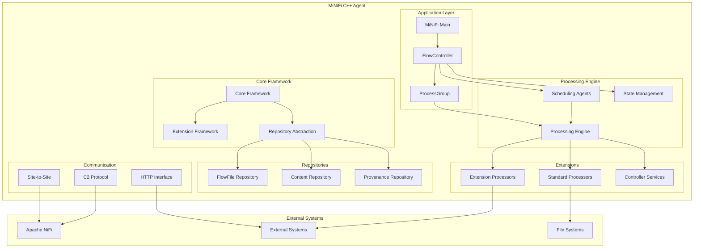

### Core Components

The MiNiFi C++ architecture is built around several core components that work together to provide data processing capabilities:

#### FlowController
The central orchestrator that manages the entire data flow execution environment.

```mermaid
classDiagram
    class FlowController {
        -running_: bool
        -root_wrapper_: RootProcessGroupWrapper
        -flow_configuration_: FlowConfiguration
        -scheduling_agents_: vector~SchedulingAgent~
        -repositories_: map~Repository~
        -c2_agent_: C2Agent
        +load(reload: bool)
        +start(): int16_t
        +stop(): int16_t
        +isRunning(): bool
        +getRoot(): ProcessGroup
    }
    
    class ProcessGroup {
        -type_: ProcessGroupType
        -processors_: vector~Processor~
        -connections_: vector~Connection~
        -child_process_groups_: vector~ProcessGroup~
        -controller_services_: map~ControllerService~
        +addProcessor(processor: Processor)
        +addConnection(connection: Connection)
        +startProcessing()
        +stopProcessing()
    }
    
    class Processor {
        -scheduled_state_: ScheduledState
        -scheduling_strategy_: SchedulingStrategy
        -properties_: map~Property~
        -relationships_: vector~Relationship~
        +onSchedule(context: ProcessContext)
        +onTrigger(context: ProcessContext, session: ProcessSession)
        +onUnSchedule()
    }
    
    class Connection {
        -source_: Connectable
        -destination_: Connectable
        -relationships_: set~Relationship~
        -flow_file_queue_: FlowFileQueue
        +poll(): FlowFile
        +offer(flowfile: FlowFile)
    }
    
    FlowController ||--|| ProcessGroup : "manages root"
    ProcessGroup ||--o{ Processor : "contains"
    ProcessGroup ||--o{ Connection : "contains"
    ProcessGroup ||--o{ ProcessGroup : "nested"
    Processor ||--o{ Connection : "connected by"
```

#### Repository System
Manages data persistence across different types of storage requirements.

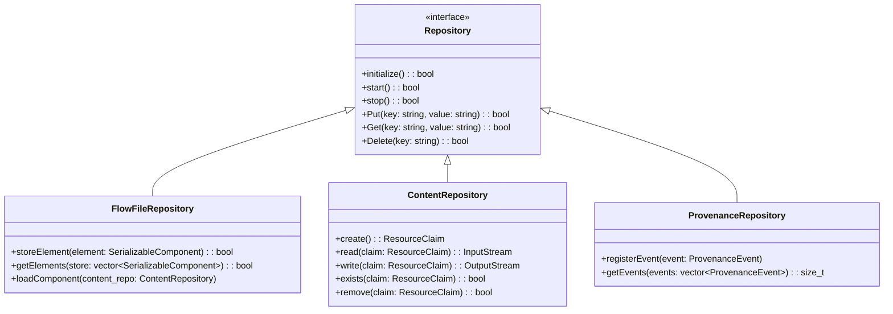

### Component Relationships

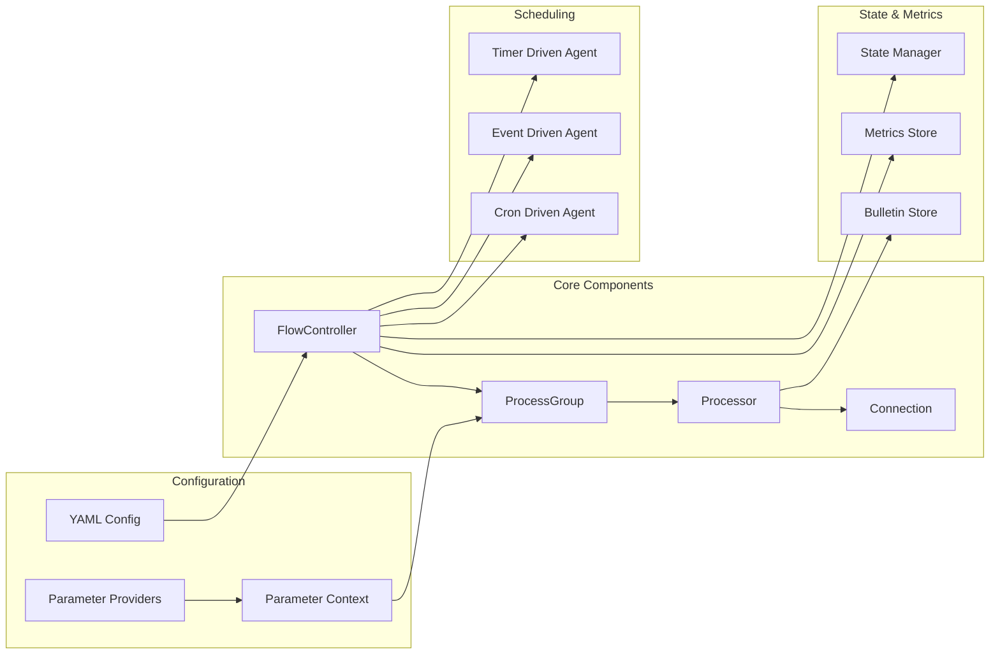

## Data Flow Architecture

### FlowFile Lifecycle

FlowFiles are the fundamental data units that flow through the MiNiFi processing pipeline.

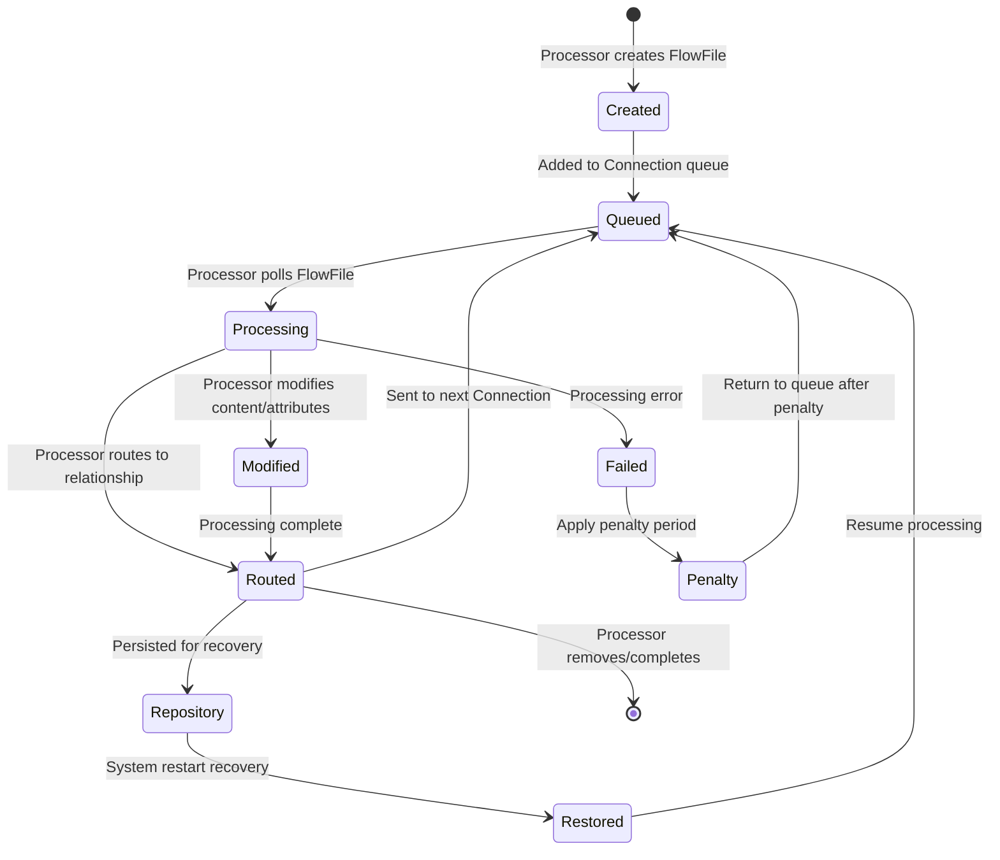

### Processing Pipeline

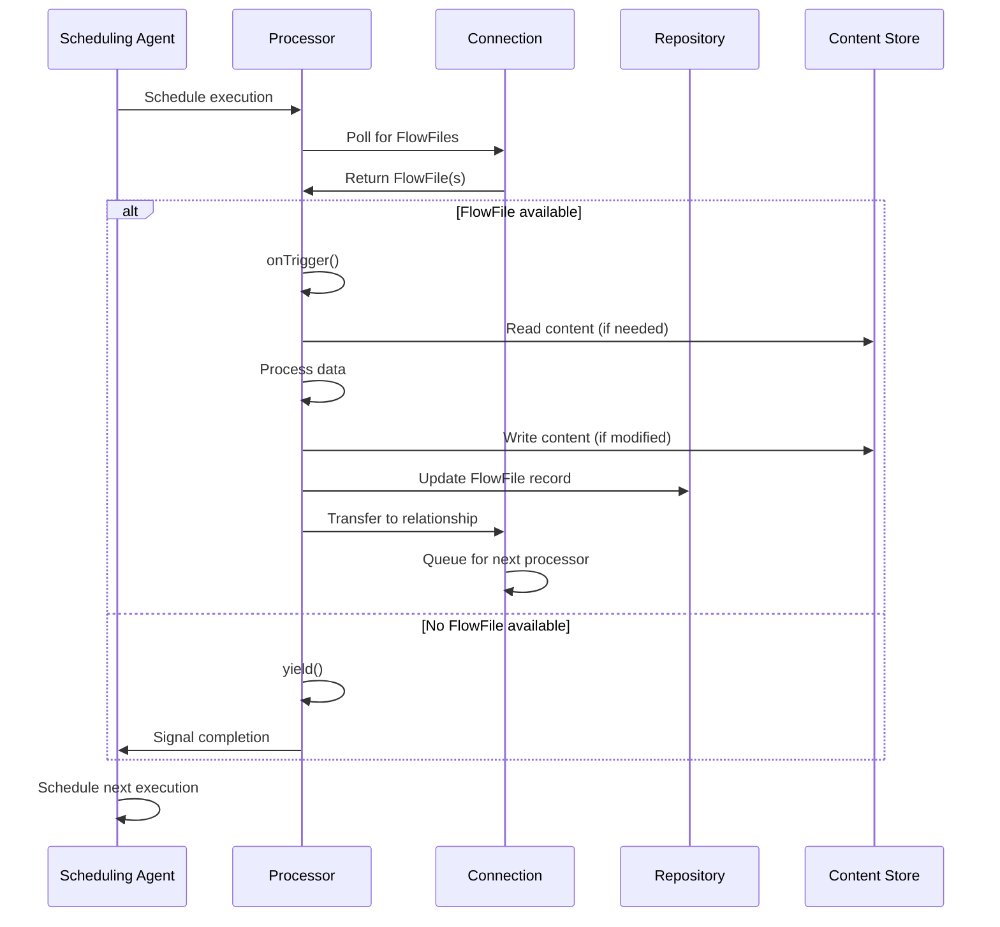

### Data Routing

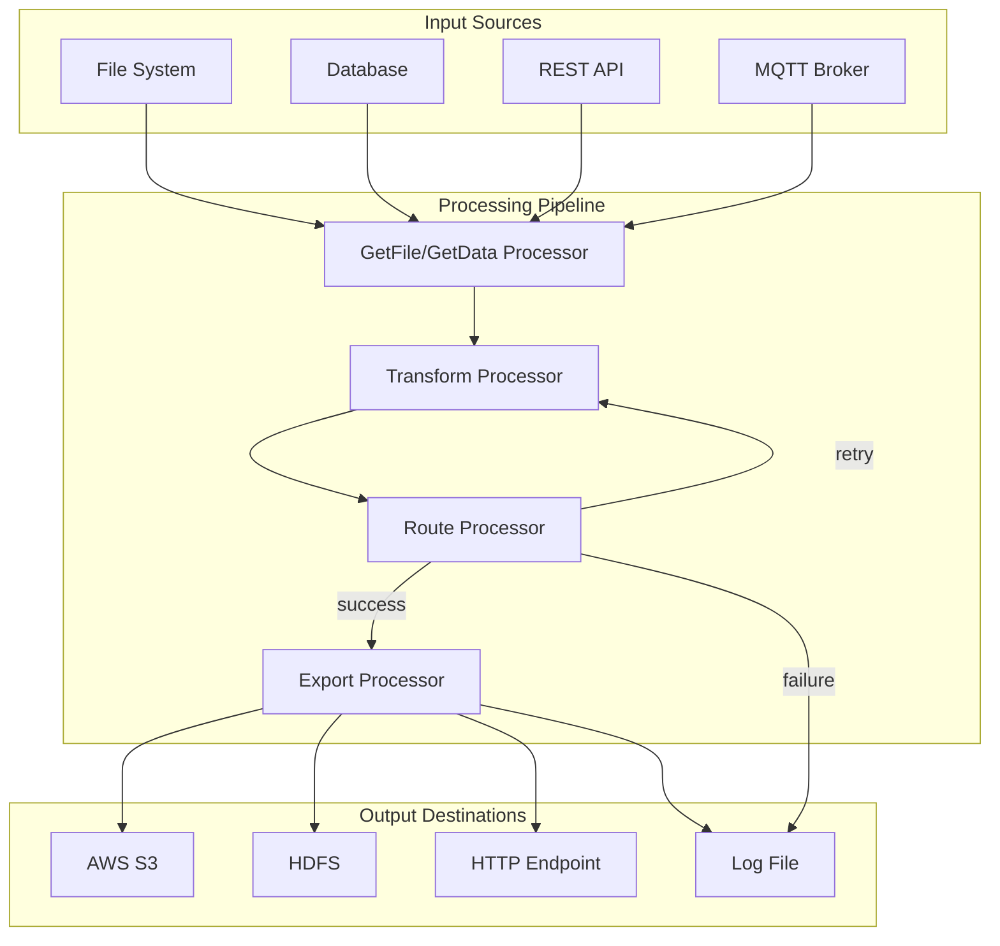

## Extension System

### Extension Framework

MiNiFi C++ uses a modular extension system that allows for dynamic loading of processors and services.

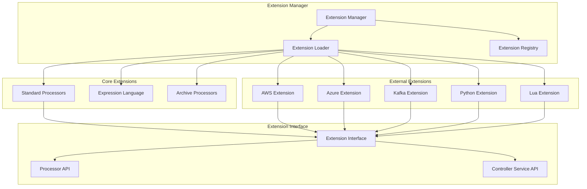

### Available Extensions

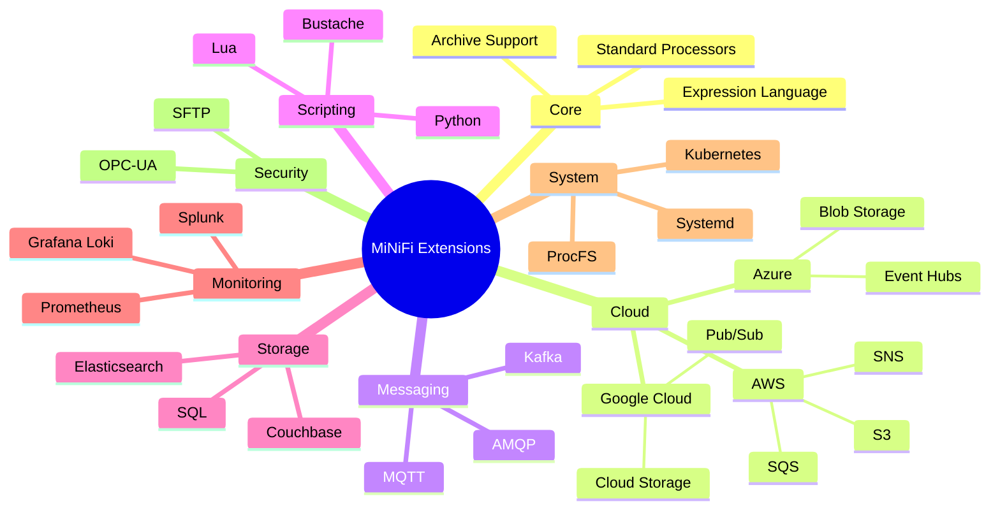

### Extension Loading

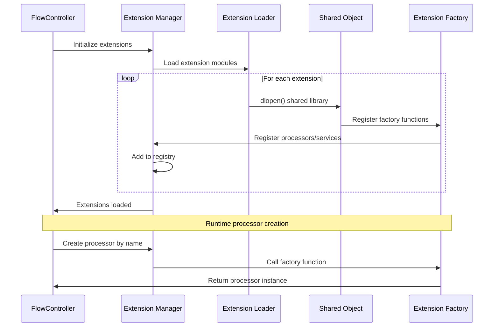

## Configuration Architecture

### Configuration Flow

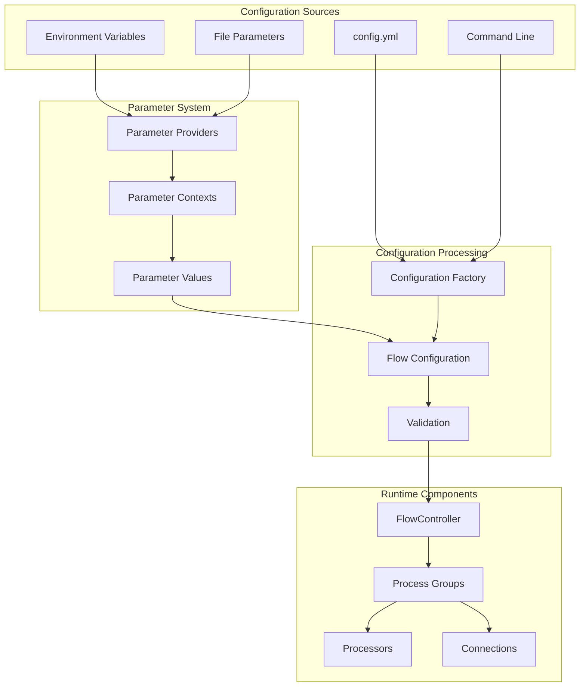

### Parameter Management

```mermaid
classDiagram
    class ParameterProvider {
        <<interface>>
        +getParameters(): map~string, string~
        +supportsRefresh(): bool
        +refresh()
    }
    
    class EnvironmentVariableParameterProvider {
        -inclusion_strategy_: string
        -include_pattern_: regex
        +getParameters(): map~string, string~
    }
    
    class FileParameterProvider {
        -file_path_: string
        -parameter_group_name_: string
        +getParameters(): map~string, string~
    }
    
    class ParameterContext {
        -name_: string
        -parameters_: map~string, Parameter~
        +getParameter(name: string): Parameter
        +setParameter(name: string, value: string)
    }
    
    class Parameter {
        -name_: string
        -value_: string
        -sensitive_: bool
        -description_: string
    }
    
    ParameterProvider <|-- EnvironmentVariableParameterProvider
    ParameterProvider <|-- FileParameterProvider
    ParameterContext ||--o{ Parameter : "contains"
    ParameterProvider ..> ParameterContext : "populates"
```

### Runtime Configuration

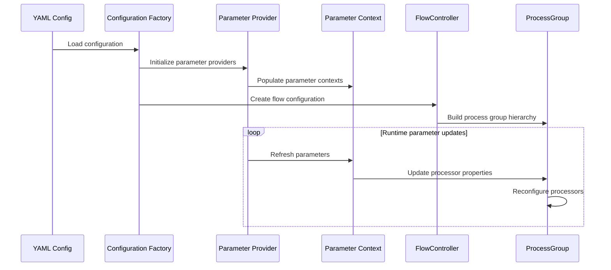

## Repository Architecture

### Repository Types

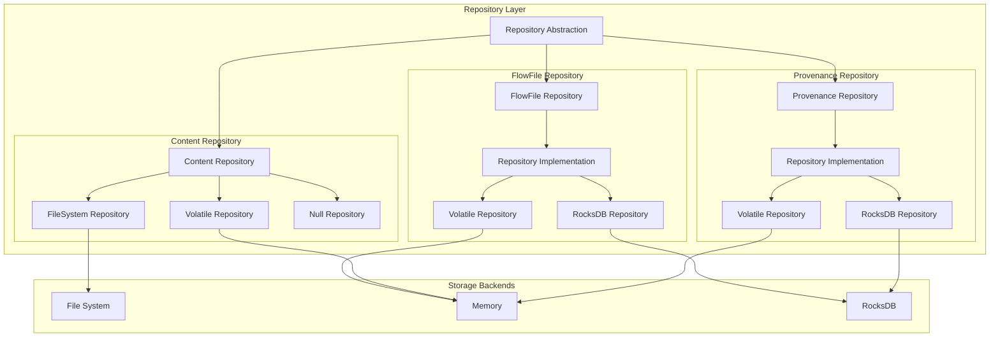

### Data Persistence

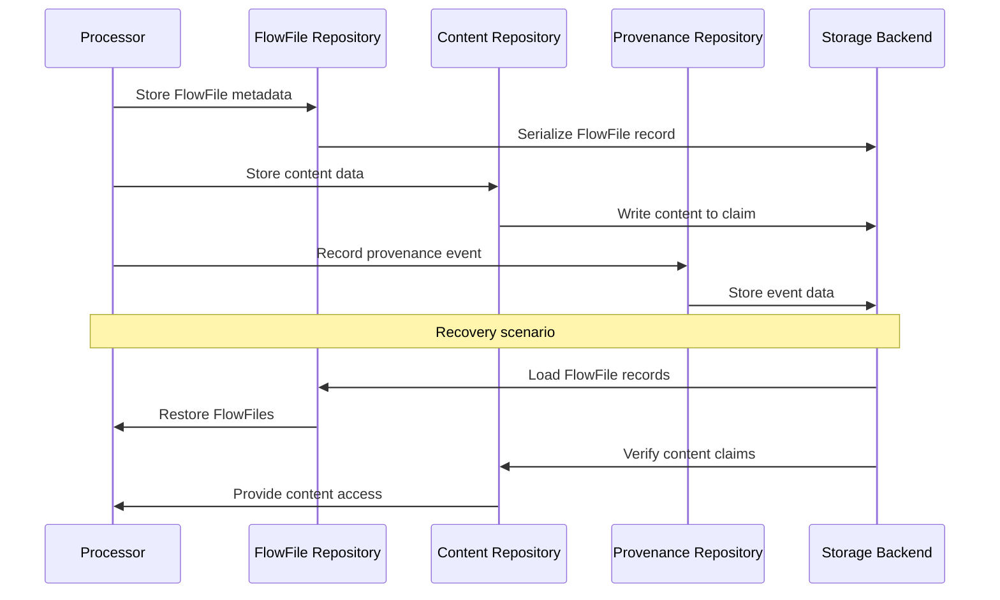

### Repository Interactions

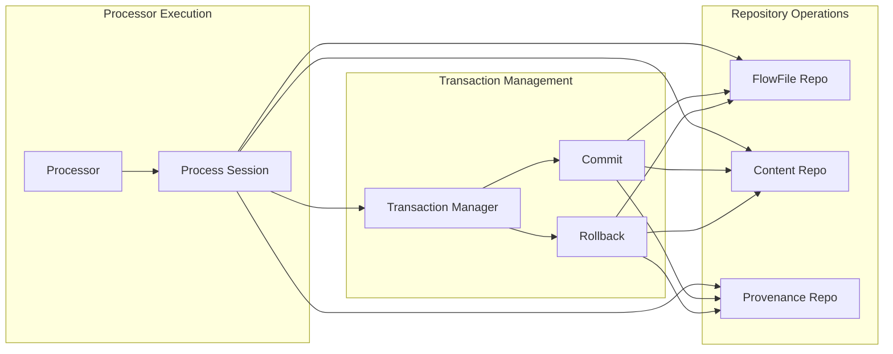

## Scheduling and Execution

### Scheduling Agents

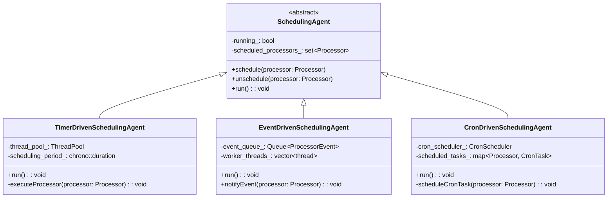

### Thread Management

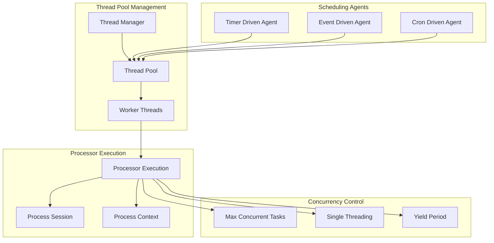

### Execution Flow

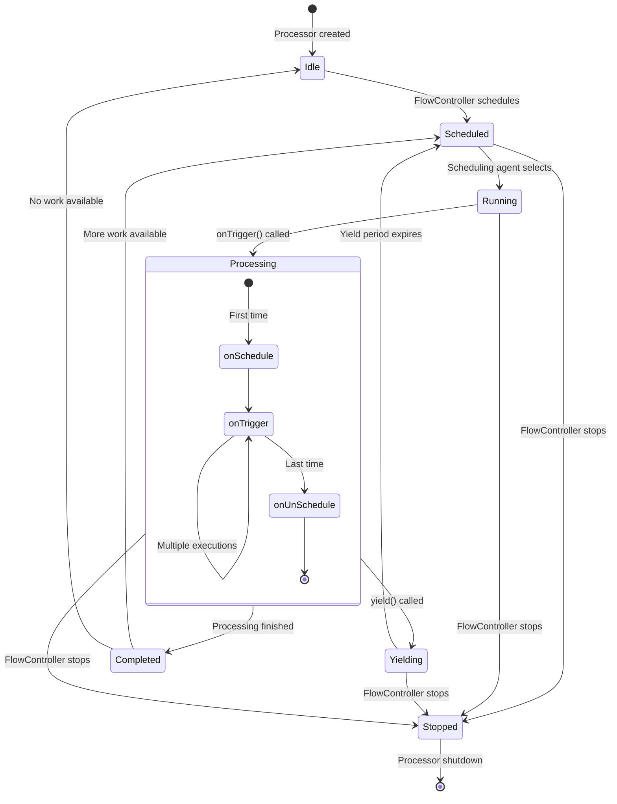

## State Management

### Component States

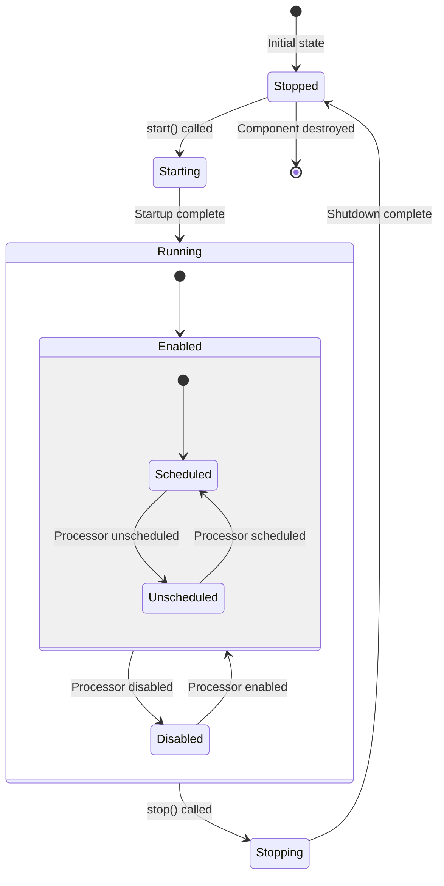

### State Transitions

```mermaid
sequenceDiagram
    participant FC as FlowController
    participant SA as Scheduling Agent
    participant P as Processor
    participant PS as Process Session
    participant R as Repository
    
    FC->>SA: start()
    SA->>P: schedule()
    P->>P: onSchedule()
    
    loop Processing Loop
        SA->>P: trigger execution
        P->>PS: createSession()
        P->>P: onTrigger(context, session)
        P->>PS: commit() or rollback()
        PS->>R: persist changes
    end
    
    FC->>SA: stop()
    SA->>P: unschedule()
    P->>P: onUnSchedule()
    P->>P: shutdown()
```

### Monitoring and Metrics

```mermaid
graph TB
    subgraph "Metrics Collection"
        MP[Metrics Publisher]
        MS[Metrics Store]
        MC[Metrics Collector]
    end
    
    subgraph "Component Metrics"
        PM[Processor Metrics]
        CM[Connection Metrics]
        RM[Repository Metrics]
        SM[System Metrics]
    end
    
    subgraph "State Information"
        CS[Component State]
        BS[Bulletin Store]
        SS[State Store]
    end
    
    subgraph "External Reporting"
        PROM[Prometheus]
        HTTP[HTTP Endpoint]
        LOG[Log Files]
    end
    
    MC --> PM
    MC --> CM
    MC --> RM
    MC --> SM
    
    MC --> MS
    MS --> MP
    
    CS --> SS
    BS --> SS
    SS --> MP
    
    MP --> PROM
    MP --> HTTP
    MP --> LOG
```

## Communication Architecture

### Site-to-Site Protocol

```mermaid
sequenceDiagram
    participant MC as MiNiFi Client
    participant MS as MiNiFi Server/NiFi
    participant HC as HTTP Client
    participant HS as HTTP Server
    
    Note over MC, HS: HTTP Site-to-Site
    MC->>HS: GET /nifi-api/site-to-site
    HS->>MC: Site-to-Site info
    MC->>HS: POST /nifi-api/data-transfer/input-ports/{port-id}/transactions
    HS->>MC: Transaction created
    MC->>HS: PUT /nifi-api/data-transfer/input-ports/{port-id}/transactions/{transaction-id}/flow-files
    HS->>MC: Flow files received
    MC->>HS: DELETE /nifi-api/data-transfer/input-ports/{port-id}/transactions/{transaction-id}
    HS->>MC: Transaction confirmed
    
    Note over MC, MS: RAW Site-to-Site
    MC->>MS: Handshake
    MS->>MC: Handshake response
    MC->>MS: Request transaction
    MS->>MC: Transaction ID
    MC->>MS: Send flow files
    MS->>MC: Acknowledgment
    MC->>MS: Confirm transaction
    MS->>MC: Transaction complete
```

### C2 Protocol

```mermaid
graph TB
    subgraph "MiNiFi Agent"
        C2A[C2 Agent]
        FC[FlowController]
        CM[Configuration Manager]
    end
    
    subgraph "C2 Server/NiFi"
        C2S[C2 Server]
        C2H[C2 Handler]
        FR[Flow Registry]
    end
    
    subgraph "C2 Operations"
        HB[Heartbeat]
        CONFIG[Configuration Update]
        MANIFEST[Manifest Request]
        METRICS[Metrics Report]
    end
    
    C2A --> HB
    C2A --> CONFIG
    C2A --> MANIFEST
    C2A --> METRICS
    
    HB --> C2S
    CONFIG --> C2S
    MANIFEST --> C2S
    METRICS --> C2S
    
    C2S --> C2H
    C2H --> FR
    
    C2A --> FC
    C2A --> CM
```

### HTTP Communication

```mermaid
flowchart TD
    subgraph "HTTP Interface"
        HS[HTTP Server]
        HR[HTTP Router]
        HH[HTTP Handlers]
    end
    
    subgraph "REST Endpoints"
        SS[System Status]
        PROC[Processor Status]
        CONN[Connection Status]
        CONFIG[Configuration]
        METRICS[Metrics]
    end
    
    subgraph "Security"
        AUTH[Authentication]
        TLS[TLS/SSL]
        CERT[Certificate Management]
    end
    
    subgraph "Client Communication"
        WEB[Web Interface]
        API[REST Client]
        CURL[Command Line]
    end
    
    WEB --> HS
    API --> HS
    CURL --> HS
    
    HS --> TLS
    HS --> AUTH
    HS --> HR
    
    HR --> HH
    HH --> SS
    HH --> PROC
    HH --> CONN
    HH --> CONFIG
    HH --> METRICS
    
    TLS --> CERT
```

---

This comprehensive architecture documentation provides a detailed technical overview of Apache NiFi MiNiFi C++, including system components, data flow patterns, extension mechanisms, and communication protocols. The Mermaid diagrams illustrate the relationships and interactions between different components, making it easier to understand the overall system design and implementation.